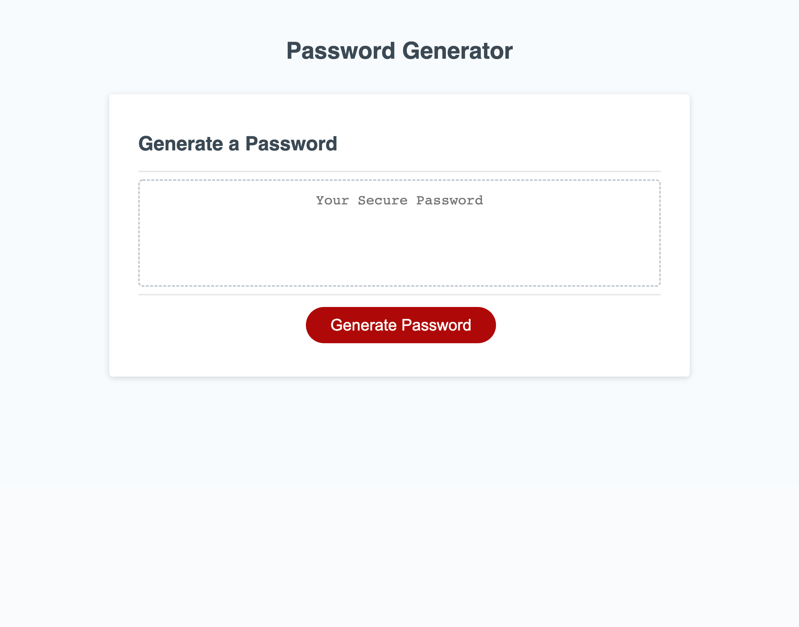

# Password-Generator-App
## Description

This website contains a password generating application. Once the button is pressed, numerous prompts appear on screen, which will then provide the user with a password. The user can choose between lower case, upper case letters, numbers and special characters for their password. 

## Installation

N/A

## Usage

This website's usage is to provide the user with a password that meets certain criteria. 

## Links

Below is the link to the deployed website:
https://mmuugii.github.io/Password-Generator-App/

## Screenshot of Website

## Credits

N/A

## License

N/A.
